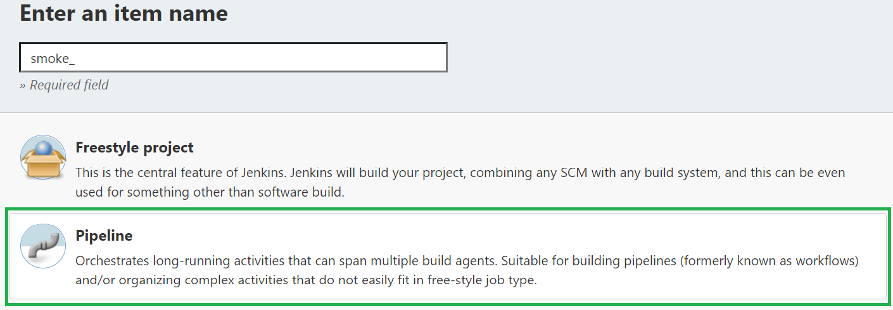
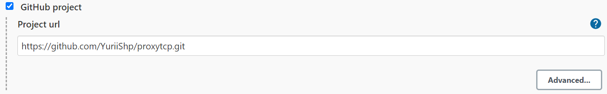
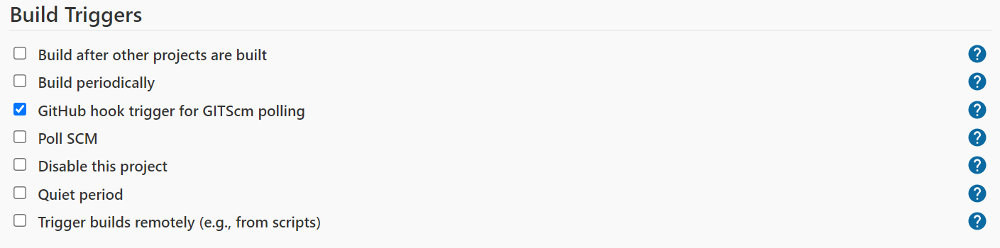
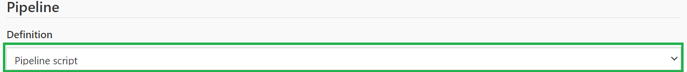

# Test Automation Framework for the Proxy Server

Test Framework allows to perform fullscale automated testing of the [Proxy Server](https://github.com/YuriiShp/proxytcp.git), further called SUT. Framework provides services of virtual test environment creation and setup, SUT deployment,  tests execution and post execution environment cleanup. Framework jobs can be easily integrated into CI piplenes (Jenkins in this case) to run different test suits on specific Github trigger events as well as run manually.

Current project build includes three test suites: smoke, regression and main, but more [can be added](#tests-development-and-debugging).

## Table of Contents

  - [Table of Contents](#table-of-contents)
  - [Necessary Preparations](#necessary-preparations)
  - [Usage](#usage)
  - [CI Setup](#ci-setup)
  - [Tests Development and Debugging](#tests-development-and-debugging)
  
## Necessary Preparations

To be able to run tests on your machine, threre are few necessary steps to get started:
- Install [Docker](https://docs.docker.com/engine/install/ubuntu/)
- Install [docker-compose](https://docs.docker.com/compose/install/)
- Create [Google Cloud project](project/src/environment/google_cloud_setup/README.md) and enable Compute Engine API
- In Google Cloud project create and download [service accout key](https://cloud.google.com/iam/docs/creating-managing-service-account-keys#:~:text=You%20can%20create%20a%20service%20account%20key%20using,is%20the%20ID%20of%20your%20Google%20Cloud%20project.) in json format*
- Create directory /share and move your service accout key in there**

\* - Note, service account key can be shared among multiple machines, so steps 3 and 4 can be scipped in case someone already done Cloud project configuration.

\*\* - Note, this project uses volumes bounded to the Linux file system, to be able to run it on Windows consider installing WSL with Ubuntu.


## Usage

Clone project to your machine:
```bash
git clone https://github.com/YuriiShp/ProxyTCP-automation-framework.git
```

With all above preparations done, we are ready to run jobs in our framework.
First of all we have to create test environment and deploy SUT. Run following command from inside the project directory:

```bash
docker-compose run --rm testenv pyats run job /pyats/project/src/jobs/build_environment.py \
    --service-key /share/YOUR_SERVICE_ACC_KEY

```
Where YOUR_SERVICE_ACC_KEY is the Google Cloud service account key.

Now environment is up and runnig so we can run tests. As mentioned in the description, there are three available test suits (or jobs, as in pyATS terminology): smoke.py, regression.py and main.py. All jobs are located in directory /pyats/project/src/jobs/ of the docker container file system. Each job requires a testbed to run on. Testbed data is contained in the testbed.yaml file located in /pyats/project/src/ directory and is passed as additional command line argument to the run job command. To find more about pyATS data model, check the official documentation. 

Run tests with the following command:
```bash
docker-compose run --rm testenv pyats run job /pyats/project/src/jobs/TEST_SUITE \
    --testbed-file /pyats/project/src/testbed.yaml
```
Where TEST_SUITE is one of the any available suits/jobs. In specific case: smoke.py, regression.py or main.py. Jobs can be run in any desireable order.

Lastly, after all necessary test have been run, environment can be destroyed. To do this use following command:
```bash
docker-compose run --rm testenv pyats run job /pyats/project/src/jobs/destroy_environment.py \
    --service-key /share/YOUR_SERVICE_ACC_KEY

```

Job execution logs can be accessed in several ways:
- Console logs
- pyATS view logs view command

The last option, unfortunately, can not be correctly utilized with docker-compose run command but it can be used perfectly fine in the development/debug mode. Another option is the email reporting, which is implemented in in CI configuration.

## CI Setup

Deploy Jenkins server and configure environment:
- Create VM using any Cloud Provider (GCP, AWS, etc.) to provide hosting for the Jenkins server
- Install [Jenkins](https://linuxize.com/post/how-to-install-jenkins-on-ubuntu-20-04/) on the VM
- Repeat steps from the [Necessary Preparation](#necessary-preparations) part on the VM
- Grant Jenkins service sudo privilages (visudo)

Now log in to Jenkins dashpoard and create pipeline for each test suite in the project.
1. Click on `New Item` link and select `Pipeline`:
   
2. Select checkbox `Github project` and paste the SUT repo url: https://github.com/YuriiShp/proxytcp.git:
   
3. In the `Build Triggers` section select checkbox `GitHub hook trigger for GITScm polling`:
   
4. In the `Pipeline` section select `Pipeline Script` from the drop-down menu:
   
5. Paste corresponding Groovy script from the jenkins/ directory into the script test area and click save.
   
Pipelines are ready and functional but few more things need to be done, which are optional but were ment to be:
- Configure [E-mail notifiacations plugin](https://www.360logica.com/blog/email-notification-in-jenkins/)
- Set up [Github Webhook](https://www.blazemeter.com/blog/how-to-integrate-your-github-repository-to-your-jenkins-project) for the SUT project (this option enables Jenkins builds on push events)

So now our jobs can be run manually and triggered on Github push events (I configured triggers in the way, that smoke job is being triggered, when changes are pushed to the develop branch, but regression is triggered when pushes are intended for master). After job is complete, email notification with logs is sent to the recipients, defined in the mail plugin configs.

## Tests Development and Debugging

### Development tools
For the development/debugging purposes Microsoft VS Code text editor with Docker extension is highly recomended. To start with development do the following:
- Make sure you've done [Necessary Preparations](#necessary-preparations)
- Clone project git repo if you have not done it yet
- From within the project directory run command*:
  ```bash
    docker-compose up -d
  ```
- Open VS Code and attach to running container
- Activate virtual environment
- You are ready

\*-Note, once container is up it can be stopped and restarted later, dont down it

### Project structure
Core project structure is implemnted relying on the pyATS data model, thus this project encounters three essential groups of structural components: jobs, testscripts and datafiles:

```
├── project
    └── src
        |
        ...
        ├── datafiles
        │   ├── browser.yaml
        │   ├── regression.yaml
        │   ├── smoke.yaml
        │   ├── socks.yaml
        │   └── tls.yaml
        ├── testscripts
        |   ├── browser.py
        |   ├── regression.py
        |   ├── smoke.py
        |   ├── socks.py
        |   └── tls.py
        └── jobs
            ├── main.py
            ├── regression.py
            └── smoke.py
         
```
Different testscripts contain their own sets of testcases logically groupped together. Testcase parameters are stored in datafiles, each testscript has its own datafile. One or more testscripts are being aggregated into job files, like here:
- jobs/smoke.py contains testscripts/smoke.py
- jobs/regression.py contains testscripts/regression.py
- jobs/main.py contains testscripts/socks.py, testscripts/tls.py, testscripts/browser.py

Within job file testscripts are being run in specified order one by one (asynchonous run is also possible but not in our case).
The jobs/ directory contains two more jobs: build_environment.py and destroy_environment.py which are completely unrelated to the test execution and were created to ease environment deployment. These jobs also use scripts, which are defined in the envscripts/ directory and might not be changed.

Another essential component of the test infrastructure is the testbed. Testbed provides information about devices network configuration needed during the tests. Testbed is configured with testbed.yaml file which in turn is dynamically generated by the environment builder every time new environment is created.

All suplamentary classes and functions needed to implement test logic and results analysis you can find in the classes/ directory.
